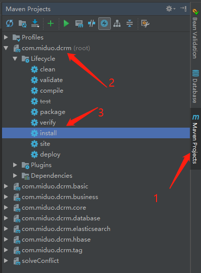
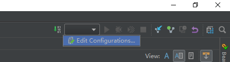
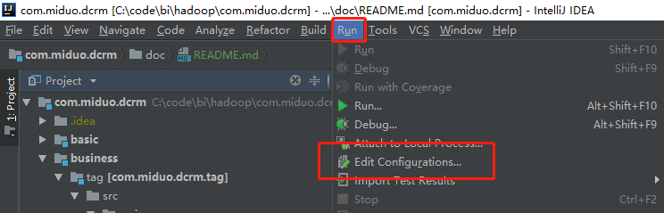
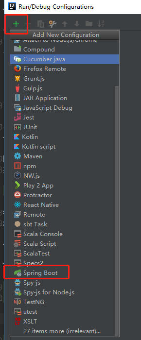
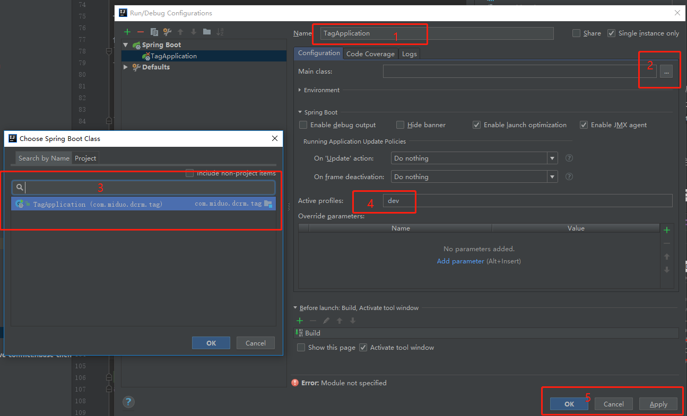
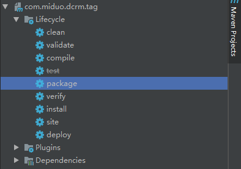
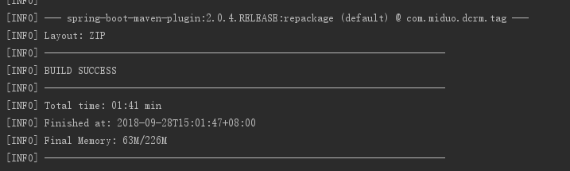
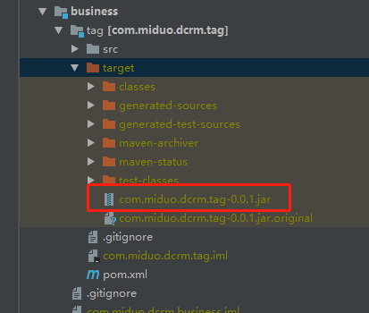

## 项目搭建与结构
本项目使用spring boot作为基础，使用的版本为2.0.4.RELEASE，使用MAVEN搭建，JDK版本1.8。

项目使用模块化开发，是为了追赶微服务的潮流，虽然现在暂未微服务化，但是以模块化的形式，
后面只需要加入服务发现，配置中心，负载均衡等组件即可实现。

### maven项目结构解析：
```$xslt
-- src
  |-- main                         
     |-- java                      源码
     |-- resources                 配置资源
        |-- application.yml        系统配置
        |-- application-dev.yml    开发环境配置
        |-- application-test.yml   测试环境配置
        |-- application-prod.yml   生产环境配置
        |-- logback.xml            logback的日志配置
  |-- test                         测试用例
     |-- java                      测试用例源码
     |-- resources                 测试用例配置资源
```

### 项目模块结构

项目主要分为`basic`和`business`两个大模块，`basic`模块包含一些需要的基础组件，如`core`、`database`等，
`business`为业务模块，现有`tag`标签业务模块。

```$xslt
-- com.miduo.dcrm ------------- 项目根目录，定义spring boot的版本
  |-- basic ------------------- 公共依赖基础包
     |-- config --------------- apollo配置中心依赖包
     |-- configSDK ------------ apollo配置中心SDK，供spark使用
     |-- core ----------------- 核心包，任何一个业务模块都应该依赖此包，包含参数解析和校验，swagger，通讯模型等
     |-- database ------------- 数据库包，需要使用数据库的模块依赖
     |-- elasticsearch -------- es包，需要使用es的模块依赖
     |-- hbase ---------------- hbase包，需要使用hbase的模块依赖
  |-- business ---------------- 业务父模块
     |-- tag ------------------ 标签业务模块，包含人群详情接口、分页接口、 es 通用接口等
  |-- solveConflict ----------- 用于解决jar包冲突，无意义
```
### 具体模块结构
- config 和 configSDK
此两包需要主要是 apollo 配置中心的使用，因为公司使用的 apollo 版本为 0.0.7，maven 中央仓库没有此版本依赖，
只能自己手动添加到本地在使用，具体请看 configSDK/lib/README.md，模块结构较为简单且没有特殊功能，这里不做介绍

- core包模块结构
```$xslt
-- com
  |-- miduo
     |-- dcrm
        |-- core
           |-- communicate   通讯模型
           |-- config        必要的配置
           |-- exception     异常处理
           |-- filter        过滤器
           |-- interceptor   拦截器
           |-- log           日志处理
           |-- resolver      参数解析
           |-- security      安全校验
           |-- swagger2      swagger配置
           |-- utils         工具包
           |-- validation    参数校验
              |-- custom     自定义校验器
```
- database包模块

包含 mybatis 的定义以及工具类，druid数据库连接池的定义和配置，另外，公司使用 sqlserver 数据库，
其 jdbc Driver 也需要手动安装到本地maven仓库，具体请看 database/doc/README.md
```$xslt
-- com
  |-- miduo
     |-- dcrm
        |-- database
           |-- aop            切面拦截 mapper 方法，用于添加一些字段值
           |-- conf           mybatis 与 druid 的配置
           |-- druid          druid 配置
           |-- mybatis  
              |-- interceptor 拦截器使用
              |-- language    language定义
           |-- utils          工具类，包含 ID 生成器
```

- elasticsearch包模块

直接依赖 elasticsearch 模块，采用原生方式开发
```$xslt
-- com
  |-- miduo
     |-- dcrm
        |-- elasticsearch
           |-- client.conf  TransportClient定义
           |-- common       公共类
           |-- helper       ES 工具类
           |-- model        ES 通用模型，包含查询模型、聚合模型和数据返回模型
```

- hbase包模块，因guava包冲突暂未使用

依赖`spring-data-hadoop-core`模块
```$xslt
-- com
  |-- miduo
     |-- dcrm
        |-- hbase
           |-- client    HbaseTemplate定义
```

- business中的tag模块

```$xslt
-- com
  |-- miduo
     |-- dcrm
        |-- tag
           |-- common          公共包，一些常量定义
           |-- controllers     控制层，与前端交互
           |-- modal           模型层，负责与数据库/ES连接查询数据
              |-- bean         DTO模型定义
              |-- query        ES查询相关
              |-- mapper       mybatis mapper，其 mapping 放在 resources 下的 mapper 目录
              |-- utils        工具类，现存放ES的query和agg生成相关工具
           |-- services        服务层，负责数据处理
           |-- TagApplication  启动类
```

## 开发流程
- 项目编译

因为没有 maven 中央仓库，新拉取的代码需要在本地编译一次，在 idea 右侧栏中点击`Maven Projext`按钮，
找到`com.miduo.dcrm`根目录，点击展开`Lifecycle`，双击`install`按钮



若报出`business`需要依赖某项目而不能编译的错误，可以在`com.miduo.dcrm`根目录下的pom文件中注释`business`模块再编译，
然后再单独编译`business`模块，步骤与编译`com.miduo.dcrm`相似，找到`com.miduo.dcrm.business`模块双击`Lifecycle`中的`install`按钮

编译过后的可以在本地 maven 仓库中找到编译后的 jar 包，一般是在`C:\Users\miduo\.m2\repository\miduo`

- 启动项目

在 idea 右上角有一个项目配置的地方，或者直接在导航栏找到`run`点击其中的`Edit Configurations`




点击右上角的`+`，找到`Spring Boot`选项点击将创建一个`Spring Boot`项目的配置，然后依次输入项目名称，
选择项目启动类（一般是根目录的`XXXApplication`类），在`Active profiles`中填入`dev`表示是开发环境，
这样会记载`resources`中的`application-dev.yml`中的配置，不同的环境需要的不同配置分别在这类文件中添加，
如dev、test、prod

**任何环境都会加载`application.yml`中的配置，这里放一些通用的配置，任何环境都不会变的，如项目名称**




## 部署流程
查看`resources`目录中相应环境的配置文件是否齐全，配置是否准确。
- 使用idea

需要部署一个项目时，首先需要编译整个项目，然后找到需要部署的 maven 项目双击其中的`package`按钮，当见到`BUILD SUCCESS`时，
可在项目`src`同一级的`target`目录中找到相应的jar包





将此jar包上传到服务器`/data/dev/services/tags/lib`目录，执行如下命令即可
```shell
nohup java -jar /data/dev/services/tags/lib/com.miduo.dcrm.tag-0.0.1.jar --spring.profiles.active=dev > /dev/null &
```
`spring.profiles.active`表示加载配置文件，同项目启动`Active profiles`

也可直接使用编写的`/data/dev/services/tags/bin`中的`start.sh`脚本，启动后会在执行命令的上一级生成日志文件

- 命令行

与使用idea相同，需要先编译整个项目，找到项目根目录执行`mvn clean install -Dmaven.test.skip=true`，
编译成功后在本地 maven 仓库找到相应jar包使用即可

- 启动项目

文件夹下包含的三个shell文件，restart.sh、start.sh、stop.sh分别是项目的重启、启动和停止脚本

初次使用时应修改start.sh中的一些配置，如apollo的环境，其中apollo配置与spring配置不冲突，都可以配置，但是以apollo为主